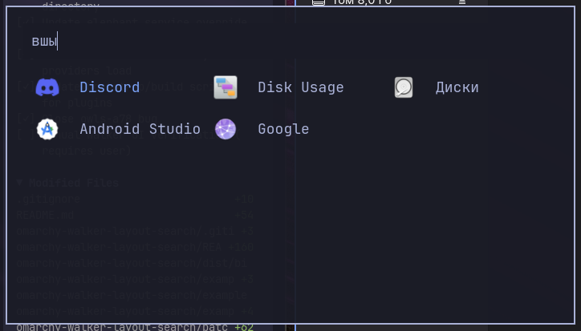

# 🐘 Walker Layout Search

### Двунаправленный поиск приложений для Omarchy  
Английская раскладка → русские результаты, и наоборот


---

## Проблема

Вы переключились на русскую раскладку, открыли Walker и набрали `ашкуащч` — ничего не найдено. Приходится переключаться обратно на английский, набирать `firefox`, и только тогда приложение появляется. Это раздражает каждый день.

## Решение

Патч для Elephant (бэкенд Walker) автоматически пробует ваш запрос в **обеих раскладках**. Если вы набрали `firefox`, он также ищет `ашкуащч`. Если набрали `ашкуащч` — ищет `firefox`. Результат с конвертированной раскладкой получает небольшой штраф к рейтингу, поэтому прямое совпадение всегда приоритетнее.

```
firefox  →  firefox (en) + ашкуащч (ru)  →  Firefox найден
ашкуащч  →  ашкуащч (ru) + firefox (en)  →  Firefox найден
```

### Пример в интерфейсе Walker

Ниже живой пример того, как это выглядит в самом Walker:

<p align="center">
  
</p>

### Как это работает

Патч заменяет функцию `calcScore()` в провайдере `desktopapplications`. При каждом запросе:

1. Оригинальный запрос скорится как обычно
2. Запрос конвертируется EN→RU и скорится с небольшим штрафом (−15 баллов)
3. Запрос конвертируется RU→EN и скорится с небольшим штрафом (−15 баллов)
4. Возвращается лучший результат

Карта раскладок покрывает все 33 буквы русского алфавита + `ё`/backtick.

---

## Требования

- [Omarchy](https://omarchy.org) с Walker + Elephant
- Go **1.26+** (для сборки бинарника и плагинов одной версией)
- Git

## Установка

### 1. Клонировать репозиторий

```bash
git clone https://github.com/CryptoMiron/Omarchy-Stuff.git
cd Omarchy-Stuff/omarchy-walker-layout-search
```

### 2. Собрать

Bootstrap скачивает исходники Elephant (привязка к конкретному коммиту), накладывает патчи и собирает всё вместе:

```bash
./scripts/bootstrap-elephant.sh
./scripts/build-elephant.sh
```

`build-elephant.sh` собирает и бинарник `elephant`, и все 12 плагинов-провайдеров (той же версией Go, чтобы не было несовпадений).

### 3. Проверить тесты

```bash
(cd vendor/elephant && go test ./internal/providers/desktopapplications -count=1)
```

### 4. Установить конфигурацию

```bash
mkdir -p ~/.config/elephant
cp -f examples/desktopapplications.toml ~/.config/elephant/desktopapplications.toml

mkdir -p ~/.config/systemd/user/elephant.service.d
cp -f examples/elephant.service.d/override.conf ~/.config/systemd/user/elephant.service.d/override.conf
```

> **Важно:** В `override.conf` указан абсолютный путь до репозитория. Если вы клонировали в другое место — отредактируйте путь.

### 5. Запустить

```bash
systemctl --user daemon-reload
systemctl --user restart elephant.service
omarchy-restart-walker
```

### 6. Проверить

```bash
./scripts/check-active-elephant.sh
```

Вывод должен показывать путь к кастомному бинарнику, 12 плагинов и переменную `ELEPHANT_PROVIDER_DIR`.

---

## Проверка в Walker

Откройте Walker и попробуйте:

| Запрос | Раскладка | Должен найтись |
|--------|-----------|----------------|
| `firefox` | EN | Firefox |
| `ашкуащч` | RU | Firefox |
| `терминал` | RU | Терминал |
| `nthvbyfk` | EN | Терминал |

---

## Структура проекта

```
omarchy-walker-layout-search/
├── patches/desktopapplications/   # Патченные файлы провайдера
│   ├── layout.go                  #   EN↔RU карта символов, convertLayout(), buildQueryVariants()
│   ├── layout_test.go             #   Тесты конвертации раскладок
│   ├── query.go                   #   Патченная calcScore() с вариантами раскладок
│   └── query_test.go              #   Тесты скоринга
├── scripts/
│   ├── bootstrap-elephant.sh      # Скачать upstream + наложить патчи
│   ├── build-elephant.sh          # Собрать бинарник + плагины
│   ├── build-plugins.sh           # Собрать только плагины
│   ├── check-active-elephant.sh   # Проверить запущенный сервис
│   └── test-bootstrap-elephant.sh # Регрессионные тесты bootstrap
├── examples/                      # Примеры конфигурации
│   ├── desktopapplications.toml
│   └── elephant.service.d/override.conf
├── dist/                          # Сборка (gitignored)
│   ├── bin/elephant
│   └── plugins/*.so
└── vendor/elephant/               # Исходники Elephant (gitignored)
```

## Архитектура

```
Walker (UI)  →  Elephant (unix socket)  →  desktopapplications.so (Go plugin)
                      │
                      └─ calcScore("firefox")
                           ├─ "firefox"  → скоринг как обычно
                           ├─ "ашкуащч"  → скоринг −15 баллов (EN→RU)
                           └─ "firefox"  → дубликат, пропущен
```

Elephant загружает провайдеры как Go-плагины (`.so`). Мы собираем и ядро, и все плагины одной версией Go, чтобы избежать ошибки `plugin was built with a different version`. Переменная `ELEPHANT_PROVIDER_DIR` указывает сервису на нашу директорию с плагинами.

## Удаление

Вернуть всё как было:

```bash
rm -f ~/.config/systemd/user/elephant.service.d/override.conf
systemctl --user daemon-reload
systemctl --user restart elephant.service
omarchy-restart-walker
```

---

**Сделано для [Omarchy](https://omarchy.org)**
